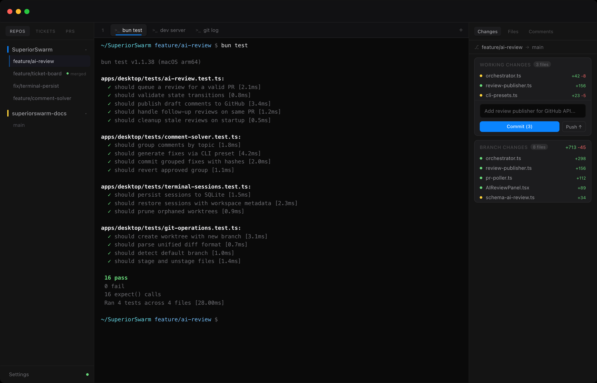
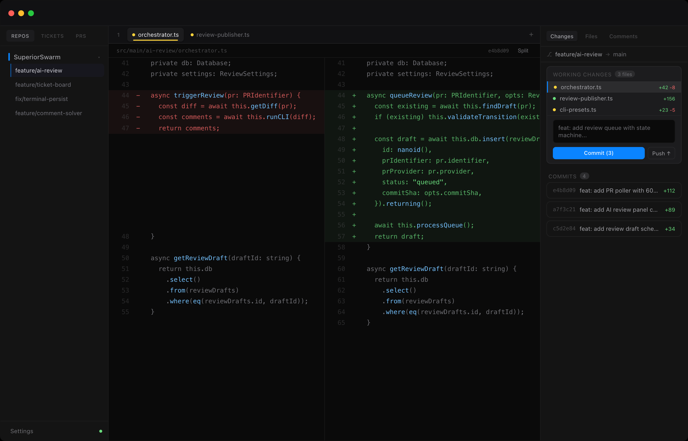
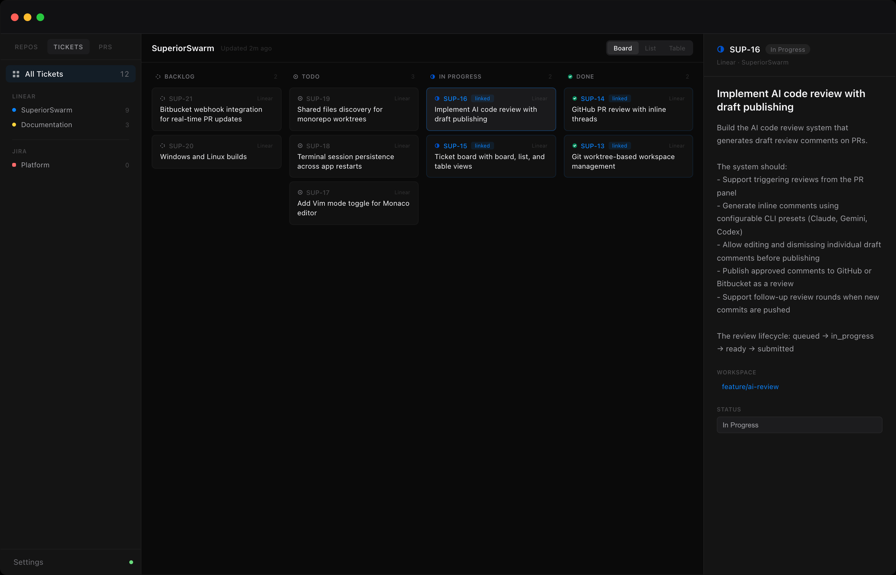
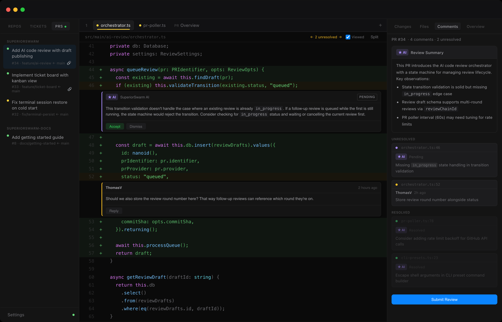

# SuperiorSwarm

**One app for your entire Git workflow. Terminals, diffs, PRs, tickets, and AI reviews in a single desktop workspace.**

---

SuperiorSwarm replaces the constant tab-switching between your terminal, Git GUI, browser PRs, and issue tracker. It wraps a terminal multiplexer, diff viewer, code editor, PR review workflow, and ticket board into one native desktop app, connected to GitHub, Bitbucket, Jira, and Linear out of the box.

## Highlights

- **Terminal Multiplexer.** Multiple persistent PTY sessions per workspace with WebGL-rendered xterm.js, search, image support, and scrollback history.
- **Git Workspaces.** First-class worktree management. Create feature branches as isolated worktrees, checkout remote branches, and switch contexts without stashing.
- **Diff & Commit.** Split or inline diffs with syntax highlighting. Stage, unstage, commit, and push without leaving the app. See commits ahead of your base branch at a glance.
- **Pull Request Reviews.** Review GitHub and Bitbucket PRs inline. Create threads, approve, request changes, mark files as viewed, and resolve discussions, all from your desktop.
- **Unified Ticket Board.** Jira and Linear issues on a single canvas. Board, list, or table view. Drag-and-drop status changes. Create branches directly from tickets.
- **AI Code Review.** Draft AI-powered reviews on any PR. Publish review comments to GitHub or Bitbucket. Trigger follow-up rounds as the PR evolves.
- **AI Comment Solver.** Automatically generate fixes for unresolved PR comments. Review grouped diffs, approve or revert, then push and post in one action.
- **Code Editor.** Monaco-based editor with LSP support, Vim mode, syntax highlighting, and go-to-definition. Edit files across worktrees without opening another tool.
- **Shared Files.** Symlink `.env`, IDE configs, and other local files across worktrees so you never have to copy them manually. SuperiorSwarm discovers candidates from your `.gitignore` and keeps them in sync.

| | |
|:---:|:---:|
|  |  |
| **Terminal & Workspaces.** Run tests, manage branches, and monitor changes from a single window. | **Diff & Commit.** Split diffs with syntax highlighting, staging, and one-click commit + push. |
|  |  |
| **Ticket Board.** Jira and Linear issues on a unified kanban board with drag-and-drop. | **PR Review & AI.** Inline AI review comments, human threads, and one-click publishing. |

## Feature Details

<strong>Terminal Multiplexer</strong>

 

SuperiorSwarm runs a background daemon process that manages PTY sessions independently of the Electron window. Terminals persist across app restarts. Close the app, reopen it, and your sessions are right where you left them.

Each workspace gets its own set of terminal tabs. Split panes let you run multiple terminals side by side. The terminal renders via xterm.js with WebGL acceleration and supports inline images, clickable URLs, Unicode 11, and up to 10,000 lines of scrollback.

<strong>Git Workspaces & Worktrees</strong>

 

Instead of juggling `git stash` and branch switches, SuperiorSwarm creates isolated Git worktrees for each workspace. Start a new feature, check out an existing remote branch, or spin up a review workspace for a PR. Each gets its own directory, terminal sessions, and pane layout.

Workspaces track their base branch, linked PRs, linked tickets, and terminal state. Everything is persisted in a local SQLite database and restored on launch.

<strong>Diff & Commit Workflow</strong>

 

The built-in diff viewer shows staged and unstaged changes separately, with syntax-highlighted split or inline diffs. Stage or unstage individual files, write a commit message, and push, all in one panel.

A branch diff mode shows the full delta between your feature branch and its base, along with a list of commits ahead. The diff viewer also powers the PR review file tabs, so the same tool works for both local changes and remote reviews.

<strong>Pull Request Reviews</strong>

 

Connect your GitHub or Bitbucket account and review PRs without opening a browser. The PR list shows status, review decisions, reviewer avatars, and CI health at a glance.

Open a PR to see its full diff. Add line-level comments, start review threads, approve or request changes, and resolve discussions. File-level review tracking lets you mark files as viewed so you can resume where you left off. Review workspaces are created automatically and cleaned up when you're done.

<strong>Unified Ticket Board</strong>

 

Jira and Linear issues appear on a single canvas. Switch between board view (kanban columns by status), list view, or table view. Filter by text, drag tickets between statuses, and expand any ticket into a detail panel.

Link tickets to workspaces to create branches named after issues. The board remembers your preferred view mode, collapsed groups, and a configurable "done cutoff" that hides old completed tickets.

<strong>AI Code Review</strong>

 

Trigger an AI-powered code review on any PR. SuperiorSwarm generates a draft review with inline comments, a summary, and actionable suggestions. Review the draft, edit or dismiss individual comments, add your own notes, then publish everything to GitHub or Bitbucket in one click.

When new commits land on the PR, trigger a follow-up review that builds on the previous round. Configure review presets, custom prompts, and auto-review behavior in settings.

<strong>AI Comment Solver</strong>

 

Unresolved PR comments pile up. The comment solver groups them by topic, generates code fixes, and presents the results as reviewable diffs, one commit per group.

Approve or revert each group individually. Add or edit reply drafts for each comment. When you're satisfied, push all approved commits and post replies to the platform in a single action.

<strong>Code Editor</strong>

 

A Monaco-powered editor with syntax highlighting for dozens of languages, line numbers, code folding, and auto-save. Optional Vim keybindings for those who prefer modal editing.

LSP integration provides go-to-definition, diagnostics, and intelligent completions. The editor opens files from the file tree, diff tabs, or PR review tabs, so you can fix issues in context without switching tools.

<strong>Shared Files Across Worktrees</strong>

 

When you use worktrees, files like `.env`, IDE configs, and build caches don't carry over. You'd normally have to copy them into every new worktree manually.

SuperiorSwarm discovers candidates from your `.gitignore`, lets you add them to a shared list, and symlinks them across all worktrees for the project. Add or remove shared files at any time and sync with one click.

## Integrations

| Service | What It Connects |
|---------|-----------------|
| **GitHub** | Pull requests, code reviews, review threads, CI status, file tracking |
| **Bitbucket** | Pull requests, inline comments, comment resolution |
| **Jira** | Issues, status transitions, sprint boards |
| **Linear** | Issues, team management, state transitions |

All integrations authenticate via OAuth 2.0. Tokens are encrypted using your operating system's keychain via Electron's `safeStorage`. Never stored in plain text.

## Tech Stack

| Layer | Technology |
|-------|-----------|
| Framework | Electron |
| Frontend | React 19, Tailwind CSS v4 |
| Language | TypeScript (strict mode) |
| State | Zustand + TanStack Query |
| RPC | tRPC over Electron IPC |
| Database | SQLite via Drizzle ORM |
| Terminal | xterm.js (WebGL) + node-pty daemon |
| Editor | Monaco Editor + LSP |
| Build | Electron Vite, Bun, Turborepo |
| Linting | Biome |

## Download

SuperiorSwarm is currently available for **macOS**.

<!-- Update with actual release link when available -->
<!-- [Download the latest release](https://github.com/VrolixThomas/SuperiorSwarm/releases/latest) -->

Check the [Releases](https://github.com/VrolixThomas/SuperiorSwarm/releases) page for the latest `.dmg`.

## License

SuperiorSwarm is distributed under a [Source Available License](LICENSE.md). You're free to use, study, and modify the software for personal, non-commercial, educational, and internal business purposes. Commercial distribution and competing hosted services are not permitted. See the full license for details.

---

Copyright 2026 Thomas Vrolix

